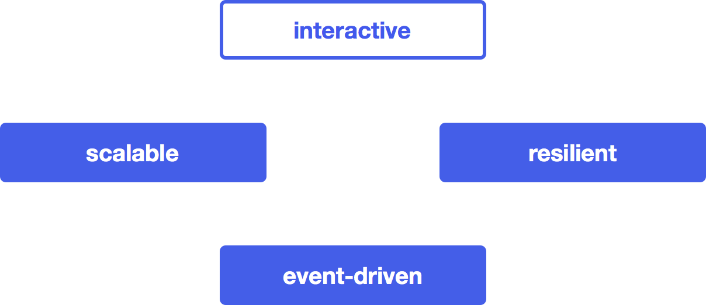
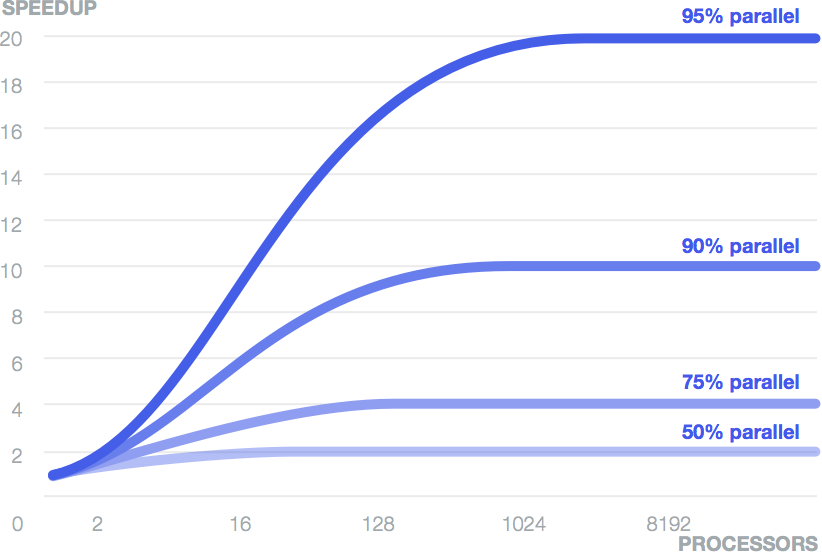
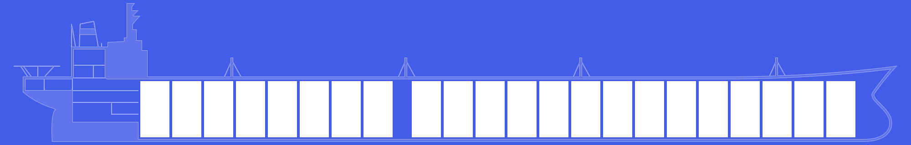
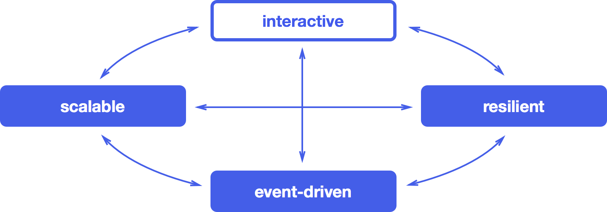

The Reactive Manifesto
----------------------

[Sign the manifesto](http://www.reactivemanifesto.org/)

## The Need to Go Reactive

Application requirements have changed dramatically in recent years. Only a few years ago a large application had tens of servers, seconds of response time, hours of offline maintenance and gigabytes of data. Today applications are deployed on everything from mobile devices to cloud-based clusters running thousands of multicore processors. Users expect millisecond or even microsecond response times and 100% uptime. Data needs are expanding into the petabytes.

Initially the domain of innovative internet-driven companies like Google or Twitter, these application characteristics are surfacing in most industries. Finance and telecommunication were the first to adopt new practices to satisfy the new requirements and others have followed.

Evolving requirements demand different technologies. Previous solutions have emphasized managed servers and containers. Scaling was achieved through buying larger servers and concurrent processing via multi-threading. Additional servers were added through complex, inefficient and expensive proprietary solutions.

But now an architecture has emerged—combining elements both long-known and novel—that lets developers conceptualize and build applications that satisfy today’s demands. We call these *Reactive Applications*. This architecture allows developers to build systems that are *event-driven, scalable, resilient and responsive*: delivering highly responsive user experiences with a real-time feel, backed by a scalable and resilient application stack, ready to be deployed on multicore and cloud computing architectures. The Reactive Manifesto describes these critical traits which are needed for *going reactive*.

## Reactive Applications

Merriam-Webster defines reactive as *“readily responsive to a stimulus”*, i.e. its components are “active” and always ready to receive events. This definition captures the essence of reactive applications, focusing on systems that:

- *react to events*: the event-driven nature enables the following qualities
- *react to load*: focus on scalability by avoiding contention on shared resources
- *react to failure*: build resilient systems with the ability to recover at all levels
- *react to users*: honor response time guarantees regardless of load

Each one of these is an essential characteristic of a reactive application. While there are dependencies between them, these traits are not like tiers in a standard layered application architecture sense. Instead they describe design properties that apply across the whole technology stack.

In the following we will take a deeper look at each of the four qualities and see how they relate to each other.

## Event-driven

### Why it is Important

An application based on asynchronous communication implements a *loosely coupled* design, much better so than one based purely on synchronous method calls. The sender and recipient can be implemented without regard to the details of how the events are propagated, allowing the interfaces to focus on the content of the communication. This leads to an implementation which is easier to extend, evolve and maintain, giving you more flexibility and reducing maintenance cost.

Since the recipient of asynchronous communication can remain dormant until an event occurs or a message is received, an event-driven approach can make efficient use of existing resources, allowing large numbers of recipients to share a single hardware thread. A non-blocking application that is under heavy load can thus have *lower latency and higher throughput* than a traditional application based on blocking synchronization and communication primitives. This results in lower operational costs, increased utilization and happier end-users.

### Key Building Blocks

In an event-driven application, the components interact with each other through the production and consumption of *events*—discrete pieces of information describing facts. These events are sent and received in an asynchronous and non-blocking fashion. Event-driven systems tend to rely on *push* rather than *pull* or *poll*, i.e. they push data towards consumers when it is available instead of wasting resources by having the consumers continually ask for or wait on the data.

- *Asynchronous* sending of events—also called *message-passing*—means that the application is highly concurrent by design and can make use of multicore hardware without changes. Any core within a CPU is able to process any message event, leading to a dramatic increase in opportunities for parallelization.
- *Non-blocking* means the ability to make continuous progress in order for the application to be *responsive* at all times, even under failure and burst scenarios. To achieve this an application must not monopolize those resources which are needed to convey a response—for example CPU, memory and IO—and release them as soon as possible. As such it can enable both lower latency, higher throughput and better *scalability*.

Traditional server-side architectures like J2EE rely on shared mutable state and blocking operations on a single thread. Both contribute to the difficulties encountered when scaling such a system to meet changing demands. Sharing mutable state requires synchronization, which introduces incidental complexity and non-determinism, making the program code hard to understand and maintain. Putting a thread to sleep by blocking uses up a finite resource and incurs a high wake-up cost.

The decoupling of event generation and processing allows the runtime platform to take care of the synchronization details and how events are dispatched across threads, while the programming abstraction is raised to the level of business workflows. You think about how events propagate through your system and how components interact instead of fiddling around with low-level primitives such as threads and locks.

Event-driven systems enable loose coupling between components and subsystems. This level of indirection is, as we will see, one of the prerequisites for scalability and resilience. By removing complex and strong dependencies between components, event-driven applications can be extended with minimal impact on the existing application.

When applications are stressed by requirements for high performance and large scalability it is difficult to predict where bottlenecks will arise. Therefore it is important that the entire solution is asynchronous and non-blocking. In a typical example this means that the design needs to be event-driven from the user request in the UI (in the browser, REST client or elsewhere) to the request parsing and dispatching in the web layer, to the service components in the middleware, through the caching and down to the database. If one of these layers does not participate—making blocking calls to the database, relying on shared mutable state, calling out to expensive synchronous operations—then the whole pipeline stalls and users will suffer through increased latency and reduced scalability.

An application must be *reactive from top to bottom*.

The need for eliminating the weakest link in the chain is well illustrated by [Amdahl’s Law](http://en.wikipedia.org/wiki/Amdahl's_law), which according to Wikipedia is explained as:

> The speedup of a program using multiple processors in parallel computing is limited by the sequential fraction of the program. For example, if 95% of the program can be parallelized, the theoretical maximum speedup using parallel computing would be 20× as shown in the diagram, no matter how many processors are used.

## Scalable

### Why it is Important

The word scalable is defined by Merriam-Webster as *“capable of being easily expanded or upgraded on demand”*. A scalable application is able to be expanded according to its usage. This can be achieved by adding elasticity to the application, the option of being able to scale out or in (add or remove nodes) on demand. In addition, the architecture makes it easy to scale up or down (deploying on a node with more or fewer CPUs) without redesigning or rewriting the application. Elasticity makes it possible to minimize the cost of operating applications in a cloud computing environment, allowing you to profit from its pay-for-what-you-use model.

Scalability also helps managing risk: providing too little hardware to keep up with user load leads to dissatisfaction and loss of customers, having too much hardware—and operations personnel—idling for no good reason results in unnecessary expense. A scalable solution also mitigates the risk of ending up with an application that is unable to make use of new hardware becoming available: we will see processors with hundreds, if not thousands of hardware threads within the next decade and utilizing their potential requires the application to be scalable at a very fine-grained level.

### Key Building Blocks

An event-driven system based on asynchronous message-passing provides a foundation for scalability. The loose coupling and location independence between components and subsystems make it possible to scale out the system onto multiple nodes while retaining the same programming model with the same semantics. Adding more instances of a component increases the system’s capacity to process events. In terms of implementation there is no difference between scaling up by utilizing multiple cores or scaling out by utilizing more nodes in a datacenter or cluster. The topology of the application becomes a deployment decision which is expressed through configuration and/or adaptive runtime algorithms responding to application usage. This is what we call [location transparency](http://en.wikipedia.org/wiki/Location_transparency).

It is important to understand that the goal is not to try to implement transparent distributed computing, distributed objects or RPC-style communication—this has been tried before and it has failed. Instead we need to *embrace the network* by representing it directly in the programming model through asynchronous message-passing. True scalability naturally involves distributed computing and with that inter-node communication which means traversing the network, that as we know is [inherently unreliable](http://aphyr.com/posts/288-the-network-is-reliable). It is therefore important to make the constraints, trade-offs and failure scenarios of network programming explicit in the programming model instead of hiding them behind leaky abstractions that try to “simplify” things. As a consequence it is equally important to provide programming tools which encapsulate common building blocks for solving the typical problems arising in a distributed environment—like mechanisms for achieving consensus or messaging abstractions which offer higher degrees of reliability.

## Resilient

### Why it is Important

Application downtime is one of the most damaging issues that can occur to a business. The usual implication is that operations simply stop, leaving a hole in the revenue stream. In the long term it can also lead to unhappy customers and a poor reputation, which will hurt the business more severely. It is surprising that application resilience is a requirement that is largely ignored or retrofitted using ad-hoc techniques. This often means that it is addressed at the wrong level of granularity using tools that are too coarse-grained. A common technique uses application server clustering to recover from runtime and server failures. Unfortunately, server failover is extremely costly and also dangerous—potentially leading to cascading failures taking down a whole cluster. The reason is that this is the wrong level of granularity for failure management which should instead be addressed using fine-grained resilience on the component level.

Merriam-Webster defines resilience as:

- *the ability of a substance or object to spring back into shape*
- *the capacity to recover quickly from difficulties*

In a reactive application, resilience is not an afterthought but part of the design from the beginning. Making failure a first class construct in the programming model provides the means to react to and manage it, which leads to applications that are highly tolerant to failure by being able to heal and repair themselves at runtime. Traditional fault handling cannot achieve this because it is defensive in the small and too aggressive in the large—you either handle exceptions right where and when they happen or you initiate a failover of the whole application instance.

### Key Building Blocks

In order to *manage failure* we need a way to *isolate* it so it doesn’t spread to other healthy components, and to *observe* it so it can be managed from a safe point outside of the failed context. One pattern that comes to mind is the [bulkhead pattern](http://skife.org/architecture/fault-tolerance/2009/12/31/bulkheads.html), illustrated by the picture, in which a system is built up from safe compartments so that if one of them fails the other ones are not affected. This prevents the classic problem of [cascading failures](http://en.wikipedia.org/wiki/Cascading_failure) and allows the management of problems in isolation.

The event-driven model, which enables scalability, also has the necessary primitives to realize this model of failure management. The loose coupling in an event-driven model provides fully isolated components in which failures can be captured together with their context, encapsulated as messages, and sent off to other components that can inspect the error and decide how to respond.

This approach creates a system where business logic remains clean, separated from the handling of the unexpected, where failure is modeled explicitly in order to be compartmentalized, observed, managed and configured in a declarative way, and where the system can heal itself and recover automatically. It works best if the compartments are structured in a hierarchical fashion, much like a large corporation where a problem is escalated upwards until a level is reached which has the power to deal with it.

The beauty of this model is that it is purely event-driven, based upon reactive components and asynchronous events and therefore *location transparent*. In practice this means that it works in a distributed environment with the same semantics as in a local context. It also means that messages passed between collaborating components can readily be persisted and replayed, adding the ability to resume processing seamlessly even after severe outages, either after repairing the system in place or immediately at a different location with access to a replicated message store.

## Responsive

### Why it is Important

Responsive is defined by Merriam-Webster as *"quick to respond or react appropriately"*. We use the word in its general meaning and it should not be confused with [Responsive Web Design](http://en.wikipedia.org/wiki/Responsive_Web_Design), which primarily refers to CSS media queries and progressive enhancements.

Responsive applications are real-time, engaging, rich and collaborative. Businesses create an open and ongoing dialog with their customers by welcoming them through *responsive* interactive experiences. This makes them more efficient, creates a feel of being connected and equipped to solve problems and accomplish tasks. One example is Google Docs which enables users to edit documents collaboratively, in real-time—allowing them to see each other’s edits and comments live, as they are made.

Applications that respond to events need to do so in a timely manner, even in the presence of failure. If an application does not respond within an applicable time constraint—otherwise known as latency—then it is effectively unavailable and therefore cannot be considered *resilient*.

The inability to meet a hard real-time system constraint amounts to a total system failure for some applications such as weapons or medical control systems. Not all applications have such strict requirements. Many applications see a rapidly decreasing utility as they deviate from response constraints, for example a financial trading application can lose the current deal without a timely response.

More mainstream applications, such as retail browsing and purchasing, show a measured decline in utility as response time increases. Users interact more with *responsive* applications, resulting in greater volumes of purchasing.

### Key Building Blocks

Reactive applications use observable models, event streams and stateful clients.

Observable models enable other systems to receive events when state changes. This can provide a real-time connection between users and systems. For example, when multiple users work concurrently on the same model, changes can be reactively synchronized bi-directionally between them, thus appearing as if the model is shared without the constraints of locking.

Event streams form the basic abstraction on which this connection is built. Keeping them reactive means avoiding blocking and instead allowing asynchronous and non-blocking transformations and communication.

Reactive applications embrace the [order of algorithms](http://en.wikipedia.org/wiki/Big_O_notation) by employing design patterns and tests to ensure a response event is returned in O(1) or at least O(log n) time regardless of load. The scaling factor can include but is not limited to customers, sessions, products and deals.

They employ a number of strategies to keep response latency consistent regardless of load profile:

- Under bursty traffic conditions reactive applications amortize the cost of expensive operations—such as IO and concurrent data exchange—by applying batching combined with an understanding and consideration of the underlying resources to keep latency consistent.
- Queues are bounded with appropriate back pressure applied, queue lengths for given response constraints are determined by employing [Little’s Law](http://en.wikipedia.org/wiki/Little's_law).
- Systems are monitored with appropriate capacity planning in place.
- Failures are isolated with alternate processing strategies readily available for when [circuit breakers](http://en.wikipedia.org/wiki/Circuit_breaker_design_pattern) are triggered.
- The resources needed to convey degraded service responses are insulated from the rest of the system to provide responsiveness in soft over-load conditions.

As an example of a responsive application consider a web application which has rich clients—browser-based or mobile apps—to create an engaging user experience. This application will execute logic and store state on the client-side in which observable models provide a mechanism to update user interfaces in real-time when data changes. Technologies like WebSockets or Server-Sent Events enable user interfaces to be connected directly with pushed event streams so the event-driven system extends all the way from the back-end to the client. This allows reactive applications to push events to browser and mobile applications in a scalable and resilient way by using asynchronous and non-blocking data transfer.

With this in mind it becomes apparent how the four qualities *event-driven*, *scalable*, *resilient* and *responsive* are interconnected to form a cohesive whole:

## Conclusion

Reactive applications represent a balanced approach to addressing a wide range of contemporary challenges in software development. Building on an *event-driven*, message-based foundation, they provide the tools needed to ensure *scalability* and *resilience*. On top of this they support rich, *responsive* user interactions. We expect that a rapidly increasing number of systems will follow this blueprint in the years ahead.

[Sign the manifesto](http://www.reactivemanifesto.org/)
